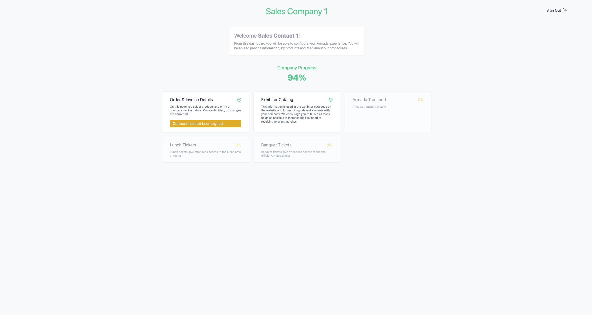
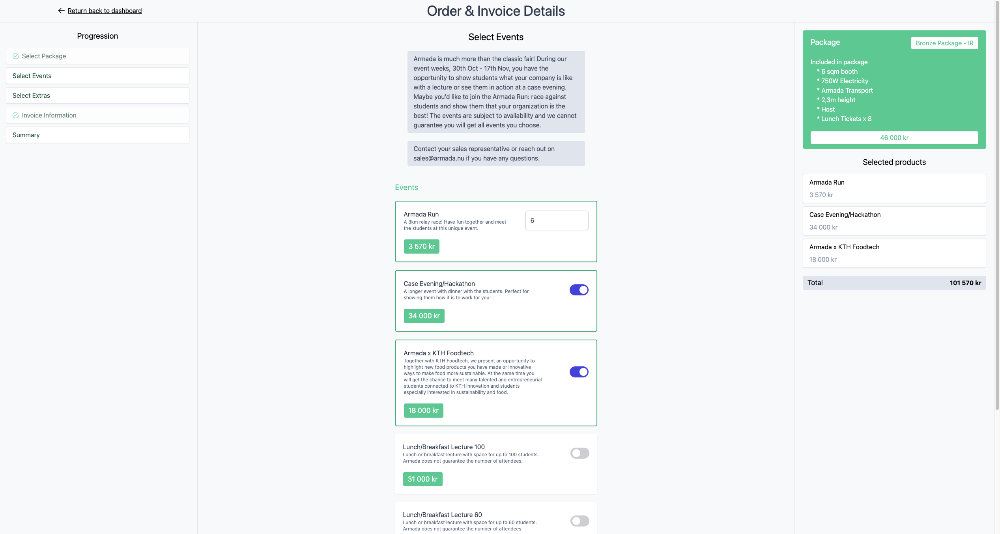

# Armada Company Dashboard

This sub-project of Armada is primarly used by companies in order to configure information, add and manage products. As of right now this dashboard supports FR (final registration).

## Commands

-   `pnpm dev` - Starts the development server.
-   `pnpm build` - Builds the project.
-   `pnpm install` - Install dependencies.

## Prerequisites

-   [Node.js](https://nodejs.org/en/) 18.17.0, if you have `nvm` installed, you can run `nvm use` to switch to the correct version.
-   [pnpm](https://pnpm.io/), if you have `npm` installed, you can run `npm i -g pnpm` to install it globally.
-   [VS Code](https://code.visualstudio.com/) We recommend using vscode to get access to the recommended extensions. If you don't want to use vscode, make sure you set up eslint and prettier to use the configuration files in this project.

## About

Project is built with vite, react, typescript, tailwindcss, redux-toolkit and pnpm.

---

### Screenshots

